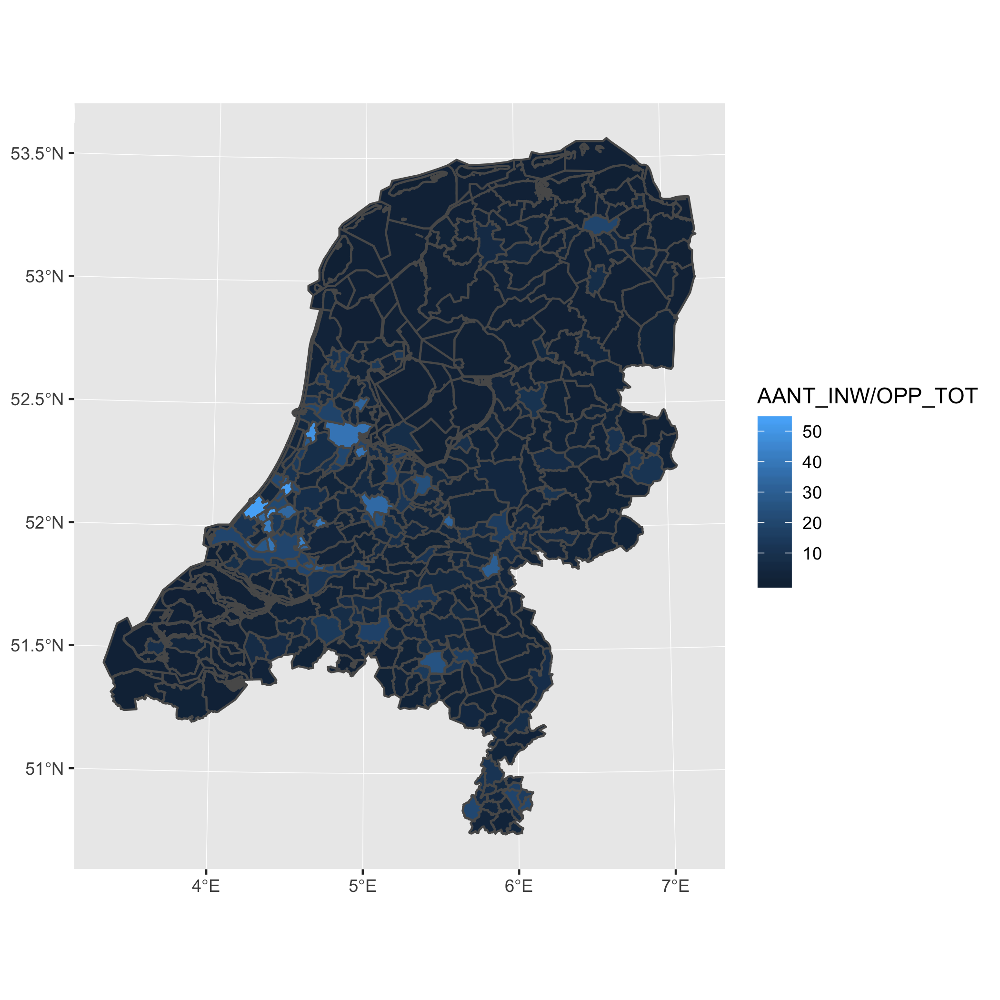

# CBS Wijk en Buurtkaart interface

This package provides a simple interface for the [CBS Wijk en Buurtkaart shapefiles](https://www.cbs.nl/nl-nl/reeksen/geografische-data). These shapefiles are available on the website of CBS.

Looking for open data from CBS? Check out [cbsodataR](https://github.com/edwindj/cbsodataR).

## Installation

Install the package directly from Github with `devtools`. The package requires `sf` for reading shapefiles.
``` R
require(devtools)
install_github("J535D165/cbsshape")
```

## Usage

Read municipality shapefiles (gemeenten) from 2017.

``` R
library(cbsshape)

cbs_shape_read(2017)
```

### Gemeente, Wijk en Buurt

Read data on 3 different levels.

``` R
# read CBS Wijk en Buurtkaart kaart on "gem"
cbs_shape_read(2018, level="gem")
cbs_shape_read(2018, level="buurt")
cbs_shape_read(2018, level="wijk")
```

By default, the Simple Features are returned in [Rijksdriehoek coordinates](https://nl.wikipedia.org/wiki/Rijksdriehoeksco%C3%B6rdinaten). One can get the result in WGS84 coordinates with the following code:

``` R
# read CBS Wijk en Buurtkaart kaart on "gem"
cbs_shape_read(2018, wgs84=TRUE)
```

### Available shapefiles

Get a list of all available shapefiles:

``` R 
> cbs_shape_list()
                                                                                                                         2009 
                                                          "http://download.cbs.nl/regionale-kaarten/2009-buurtkaart-gn-3.zip" 
                                                                                                                         2010 
                                                "http://download.cbs.nl/regionale-kaarten/2010-buurtkaart-shape-versie-3.zip" 
                                                                                                                         2011 
                                                "http://download.cbs.nl/regionale-kaarten/2011-buurtkaart-shape-versie-3.zip" 
                                                                                                                         2012 
                                                         "http://download.cbs.nl/regionale-kaarten/shape-2012-versie-3.0.zip" 
                                                                                                                         2013 
                                                         "http://download.cbs.nl/regionale-kaarten/shape-2013-versie-3-0.zip" 
                                                                                                                         2014 
                                                     "https://www.cbs.nl/-/media/_pdf/2016/35/shape%202014%20versie%2030.zip" 
                                                                                                                         2015 
                                                                     "https://www.cbs.nl/-/media/_pdf/2017/36/buurt_2015.zip" 
                                                                                                                         2016 
"https://www.cbs.nl/-/media/cbs/dossiers/nederland%20regionaal/wijk-en-buurtstatistieken/shape%202016%20versie%2030.zip"
                                                                                                                         2017 
"https://www.cbs.nl/-/media/cbs/dossiers/nederland%20regionaal/wijk-en-buurtstatistieken/wijkbuurtkaart_2017_v3.zip"
                                                                                                                         2018 
"https://www.cbs.nl/-/media/cbs/dossiers/nederland%20regionaal/wijk-en-buurtstatistieken/wijkbuurtkaart_2018_v2.zip"

```

### Download

One can use `cbsshape` to download shapefiles.
``` R
cbs_shape_download(2017, "wijkenbuurt2017/")
```

and read the local shapefile

``` R
cbs_shape_read(2017, "wijkenbuurt2017/")

```

Combine the download and read function to download the data only if not available. 

``` R
if (!cbs_shape_exists(2017, path="wijkenbuurt2017")){
  cbs_shape_download(2017, path="wijkenbuurt2017")
}

cbs_shape_read(2017, level="gem", path="wijkenbuurt2017")
```

## Examples

### Population density

``` R
library(cbsshape)
library(ggplot2)
library(dplyr)

# download 2017 data
wijk_en_buurt_2017 <- cbs_shape_read(2017)

# plot map
wijk_en_buurt_2017 %>% 
  # remove water polygons
  filter(WATER == "NEE") %>%
  # compute the population density
  mutate(density = AANT_INW/OPP_LAND*100) %>% 
  # plot the map
  ggplot() + 
    geom_sf(aes(fill=density))
```



### Distance to Amsterdam

Compute the distance between every municipality in The Netherlands and the
city of Amsterdam. 

``` R
library(cbsshape)
library(sf)
library(tidyverse)

# download 2017 data
wijk_en_buurt_2017 <- cbs_shape_read(2017) %>%     
  filter(GM_CODE != "GM9999") %>% 
  filter(WATER == "NEE")
  
# compute the centroids
df_centroids <- wijk_en_buurt_2017 %>% 
  mutate(centroid = st_centroid(geometry)) %>%
  st_drop_geometry()

# grab the centroid of Amsterdam
centroid_amsterdam <- df_centroids %>% 
  filter(GM_NAAM == "Amsterdam") %>% 
  pull(centroid)

# Compute the distance to Amsterdam
st_distance(df_centroids$centroid, centroid_amsterdam)

```


