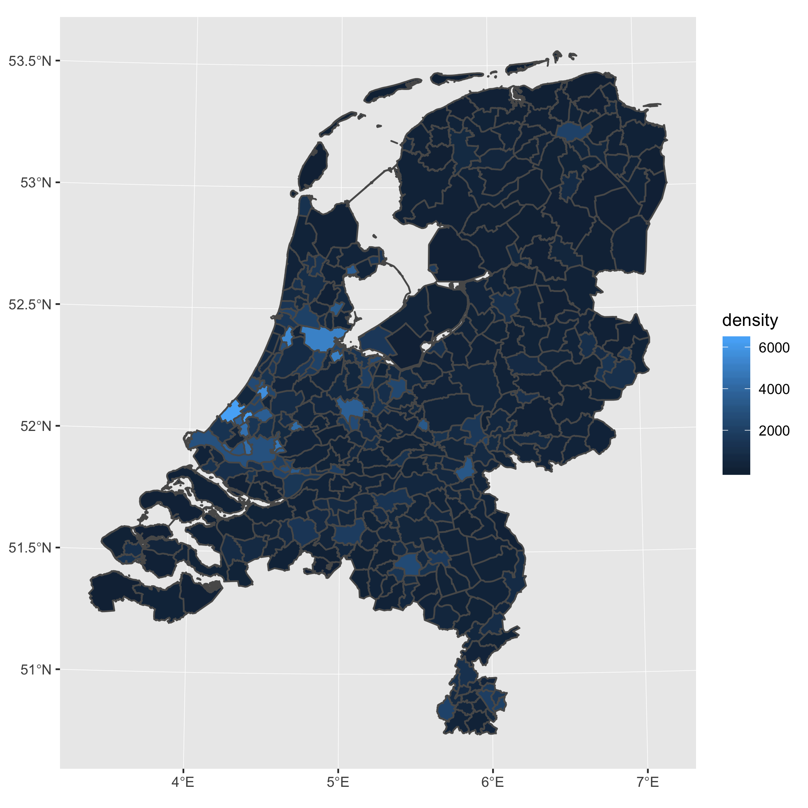

# CBS Wijk en Buurtkaart interface

This package provides a simple interface for the [CBS Wijk en Buurtkaart shapefiles](https://www.cbs.nl/nl-nl/reeksen/geografische-data). These shapefiles are available on the website of CBS.

Looking for open data from CBS? Check out [cbsodataR](https://github.com/edwindj/cbsodataR).

## Installation

Install the package directly from Github with `devtools`. The package requires `sf` for reading shapefiles.
``` R
install_github("J535D165/cbsshape")
```

## Usage

Read municipality shapefiles (gemeenten) from 2017.

``` R
library(cbsshape)

st_read_cbs(2017)
```

## Download

One can use `cbsshape` to download shapefiles.
``` R
download_cbs_shapefile(2017, "data/")
```

and read the local shapefile

``` R
st_read_cbs(2017, "data/")

```

## Examples

### Population density

``` R
library(cbsshape)
library(ggplot2)
library(dplyr)

# download 2017 data
wijk_en_buurt_2017 <- st_read_cbs(2017)

# plot map
wijk_en_buurt_2017 %>% 
  # remove water polygons
  filter(WATER == "NEE") %>%
  # compute the population density
  mutate(density = AANT_INW/OPP_LAND*100) %>% 
  # plot the map
  ggplot() + 
    geom_sf(aes(fill=density))
```



### Distance to Amsterdam

Compute the distance between every municipality in The Netherlands and the
city of Amsterdam. 

``` R
library(cbsshape)
library(sf)
library(tidyverse)

# download 2017 data
wijk_en_buurt_2017 <- st_read_cbs(2017) %>%     
  filter(GM_CODE != "GM9999") %>% 
  filter(WATER == "NEE")
  
# compute the centroids
df_centroids <- wijk_en_buurt_2017 %>% 
  mutate(centroid = st_centroid(geometry)) %>%
  st_drop_geometry()

# grab the centroid of Amsterdam
centroid_amsterdam <- df_centroids %>% 
  filter(GM_NAAM == "Amsterdam") %>% 
  pull(centroid)

# Compute the distance to Amsterdam
st_distance(df_centroids$centroid, centroid_amsterdam)

```


